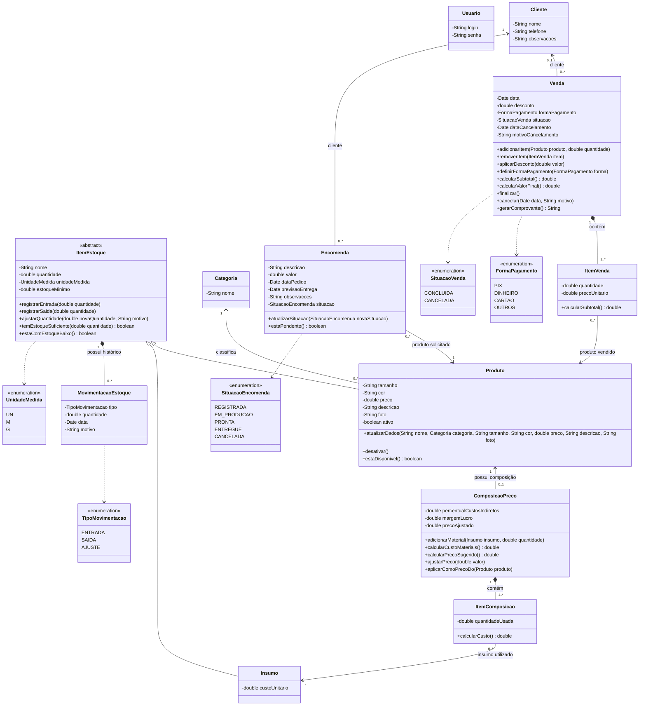

```mermaid
classDiagram
    direction TB

    %% ===== Acesso =====
    class Usuario {
        -String login
        -String senha
    }

    %% ===== Estoque =====
    class ItemEstoque {
        <<abstract>>
        -String nome
        -double quantidade
        -UnidadeMedida unidadeMedida
        -double estoqueMinimo
        +registrarEntrada(double quantidade)
        +registrarSaida(double quantidade)
        +ajustarQuantidade(double novaQuantidade, String motivo)
        +temEstoqueSuficiente(double quantidade) boolean
        +estaComEstoqueBaixo() boolean
    }

    class Produto {
        -String tamanho
        -String cor
        -double preco
        -String descricao
        -String foto
        -boolean ativo
        +atualizarDados(String nome, Categoria categoria, String tamanho, String cor, double preco, String descricao, String foto)
        +desativar()
        +estaDisponivel() boolean
    }

    class Insumo {
        -double custoUnitario
    }

    class Categoria {
        -String nome
    }

    class MovimentacaoEstoque {
        -TipoMovimentacao tipo
        -double quantidade
        -Date data
        -String motivo
    }

    %% ===== Clientes =====
    class Cliente {
        -String nome
        -String telefone
        -String observacoes
    }

    %% ===== Vendas =====
    class Venda {
        -Date data
        -double desconto
        -FormaPagamento formaPagamento
        -SituacaoVenda situacao
        -Date dataCancelamento
        -String motivoCancelamento
        +adicionarItem(Produto produto, double quantidade)
        +removerItem(ItemVenda item)
        +aplicarDesconto(double valor)
        +definirFormaPagamento(FormaPagamento forma)
        +calcularSubtotal() double
        +calcularValorFinal() double
        +finalizar()
        +cancelar(Date data, String motivo)
        +gerarComprovante() String
    }

    class ItemVenda {
        -double quantidade
        -double precoUnitario
        +calcularSubtotal() double
    }

    %% ===== Encomendas =====
    class Encomenda {
        -String descricao
        -double valor
        -Date dataPedido
        -Date previsaoEntrega
        -String observacoes
        -SituacaoEncomenda situacao
        +atualizarSituacao(SituacaoEncomenda novaSituacao)
        +estaPendente() boolean
    }

    %% ===== Precificação =====
    class ComposicaoPreco {
        -double percentualCustosIndiretos
        -double margemLucro
        -double precoAjustado
        +adicionarMaterial(Insumo insumo, double quantidade)
        +calcularCustoMateriais() double
        +calcularPrecoSugerido() double
        +ajustarPreco(double valor)
        +aplicarComoPrecoDo(Produto produto)
    }

    class ItemComposicao {
        -double quantidadeUsada
        +calcularCusto() double
    }

    %% ===== Enumerações =====
    class UnidadeMedida {
        <<enumeration>>
        UN
        M
        G
    }

    class TipoMovimentacao {
        <<enumeration>>
        ENTRADA
        SAIDA
        AJUSTE
    }

    class FormaPagamento {
        <<enumeration>>
        PIX
        DINHEIRO
        CARTAO
        OUTROS
    }

    class SituacaoVenda {
        <<enumeration>>
        CONCLUIDA
        CANCELADA
    }

    class SituacaoEncomenda {
        <<enumeration>>
        REGISTRADA
        EM_PRODUCAO
        PRONTA
        ENTREGUE
        CANCELADA
    }

    %% ===== Generalização =====
    ItemEstoque <|-- Produto
    ItemEstoque <|-- Insumo

    %% ===== Associações =====
    Categoria "1" <-- "0..*" Produto : classifica

    %% ===== Histórico de estoque =====
    ItemEstoque "1" *-- "0..*" MovimentacaoEstoque : possui histórico

    %% ===== Clientes e vendas =====
    Cliente "0..1" <-- "0..*" Venda : cliente

    Venda "1" *-- "1..*" ItemVenda : contém
    ItemVenda "0..*" --> "1" Produto : produto vendido

    %% ===== Clientes e encomendas =====
    Cliente "1" <-- "0..*" Encomenda : cliente
    Encomenda "0..*" --> "1" Produto : produto solicitado

    %% ===== Composição de preço =====
    Produto "1" <-- "0..1" ComposicaoPreco : possui composição
    ComposicaoPreco "1" *-- "1..*" ItemComposicao : contém
    ItemComposicao "0..*" --> "1" Insumo : insumo utilizado

    %% ===== Dependências de tipos =====
    ItemEstoque ..> UnidadeMedida
    MovimentacaoEstoque ..> TipoMovimentacao
    Venda ..> FormaPagamento
    Venda ..> SituacaoVenda
    Encomenda ..> SituacaoEncomenda
```
