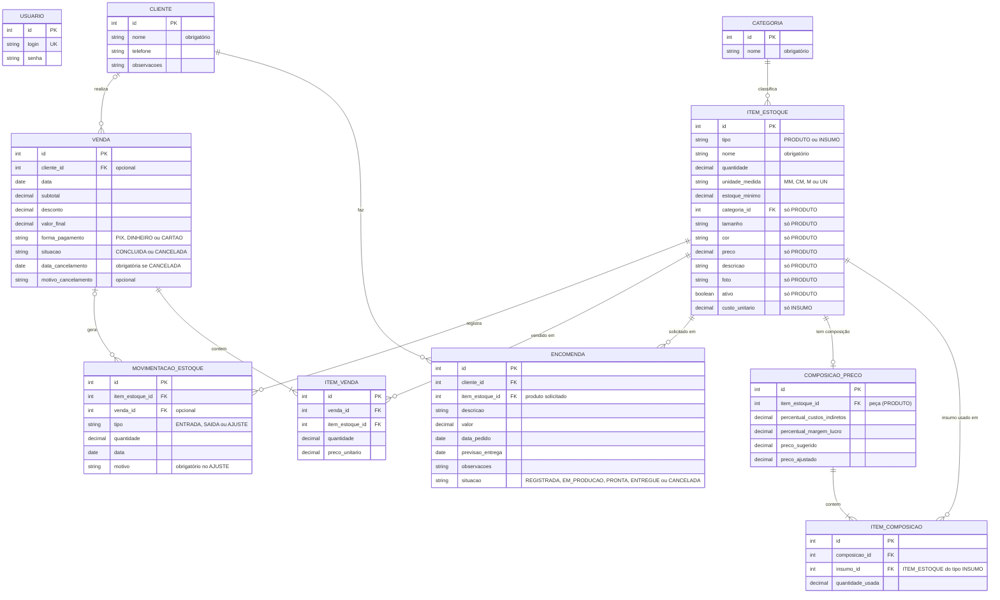

```mermaid
erDiagram
    USUARIO {
        int id PK
        string login UK
        string senha
    }

    CATEGORIA {
        int id PK
        string nome "obrigatório"
    }

    ITEM_ESTOQUE {
        int id PK
        string tipo "PRODUTO ou INSUMO"
        string nome "obrigatório"
        decimal quantidade
        string unidade_medida "MM, CM, M ou UN"
        decimal estoque_minimo
        int categoria_id FK "só PRODUTO"
        string tamanho "só PRODUTO"
        string cor "só PRODUTO"
        decimal preco "só PRODUTO"
        string descricao "só PRODUTO"
        string foto "só PRODUTO"
        boolean ativo "só PRODUTO"
        decimal custo_unitario "só INSUMO"
    }

    MOVIMENTACAO_ESTOQUE {
        int id PK
        int item_estoque_id FK
        int venda_id FK "opcional"
        string tipo "ENTRADA, SAIDA ou AJUSTE"
        decimal quantidade
        date data
        string motivo "obrigatório no AJUSTE"
    }

    CLIENTE {
        int id PK
        string nome "obrigatório"
        string telefone
        string observacoes
    }

    VENDA {
        int id PK
        int cliente_id FK "opcional"
        date data
        decimal subtotal
        decimal desconto
        decimal valor_final
        string forma_pagamento "PIX, DINHEIRO ou CARTAO"
        string situacao "CONCLUIDA ou CANCELADA"
        date data_cancelamento "obrigatória se CANCELADA"
        string motivo_cancelamento "opcional"
    }

    ITEM_VENDA {
        int id PK
        int venda_id FK
        int item_estoque_id FK
        decimal quantidade
        decimal preco_unitario
    }

    ENCOMENDA {
        int id PK
        int cliente_id FK
        int item_estoque_id FK "produto solicitado"
        string descricao
        decimal valor
        date data_pedido
        date previsao_entrega
        string observacoes
        string situacao "REGISTRADA, EM_PRODUCAO, PRONTA, ENTREGUE ou CANCELADA"
    }

    COMPOSICAO_PRECO {
        int id PK
        int item_estoque_id FK "peça (PRODUTO)"
        decimal percentual_custos_indiretos
        decimal percentual_margem_lucro
        decimal preco_sugerido
        decimal preco_ajustado
    }

    ITEM_COMPOSICAO {
        int id PK
        int composicao_id FK
        int insumo_id FK "ITEM_ESTOQUE do tipo INSUMO"
        decimal quantidade_usada
    }

    CATEGORIA ||--o{ ITEM_ESTOQUE : classifica
    ITEM_ESTOQUE ||--o{ MOVIMENTACAO_ESTOQUE : registra
    VENDA |o--o{ MOVIMENTACAO_ESTOQUE : gera
    CLIENTE |o--o{ VENDA : realiza
    VENDA ||--|{ ITEM_VENDA : contem
    ITEM_ESTOQUE ||--o{ ITEM_VENDA : "vendido em"
    CLIENTE ||--o{ ENCOMENDA : faz
    ITEM_ESTOQUE ||--o{ ENCOMENDA : "solicitado em"
    ITEM_ESTOQUE ||--o| COMPOSICAO_PRECO : "tem composição"
    COMPOSICAO_PRECO ||--|{ ITEM_COMPOSICAO : contem
    ITEM_ESTOQUE ||--o{ ITEM_COMPOSICAO : "insumo usado em"
```